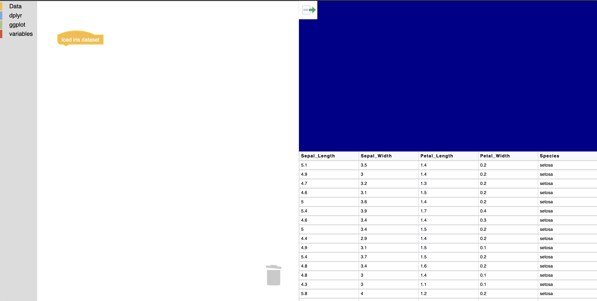
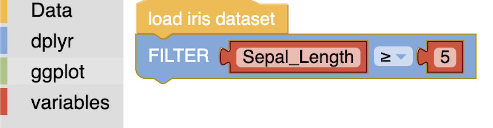
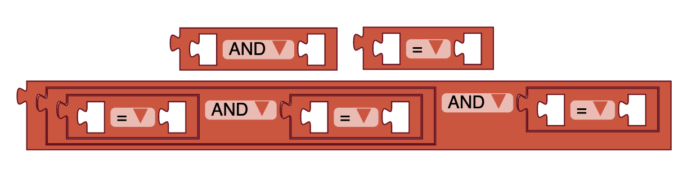
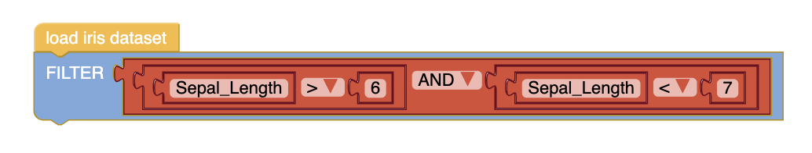

<video controls="controls" width="800" height="600" 
       name="Video Name" src="filterdemo.mov"></video>
       
Once I had a conceptual framework of blocks in place I could hit the ground running creating blocks that would simulate functions in `dplyr`. 

# DATA 

First off was a data set block. I created a block with a cap because data blocks shouldn't have any inputs. The generator code was as simple as it only needs to `return iris`.



```{js}
// block code
Blockly.defineBlocksWithJsonArray([
 {
  "type": "data_iris",
  "message0": "load iris dataset",
  "nextStatement": null,
  "style": {"hat":"cap"},
  "colour": "#FEBE4C"
 }

// generator code
Blockly.JavaScript['data_iris'] = function(block) {
	return 'iris'
}
```

I turned the iris dataset into a JSON object in R, then assigned the JSON object to `var iris` in my main html.

```{r}
library(rjson)
x <- toJSON(unname(split(iris, 1:nrow(iris))))
cat(x)
```

This was an epiphany moment: that I could store the data entirely elsewhere, all the iris block needs to do is return the iris variable!

# FILTER

Next I decided to tackle a filter block. In `data-forge` synatx, this means `.where(row => row.colName === "someValue")`. Because I have the `iris` dataset, rather than think in generalizations I began with the concrete example `iris.where(row => row.Sepal_Length > 5)`. 



In order to get the `iris` part of the statement all I need to do is click this block to the dataset block, so we're already good there! I created a block with an input called `Columns` (where the user will select the column to filter by, in this case `Sepal_Length`), a drop down menu of operators (where the user will select `>`), and lastly a variable input to filter by (`5`). The generator code is a little more complex in that we need to access the users inputs of these three fields then print them within our where statement.


```{js}
Blockly.JavaScript['dplyr_filter'] = function(block) {

  // Comparison operator
  
  // the user sees pretty utf-8 symbols rather than what JavaScript reads for operations. These symbols all have keys, and we use those keys here to tell our generator code how to translate the utf-8 selection by assigning the keys their javascript readable values.
  
  var OPERATORS = {
    'EQ': '==',
    'NEQ': '!=',
    'LT': '<',
    'LTE': '<=',
    'GT': '>',
    'GTE': '>='
  };
  
  // Now we can extract the drop down operator the user selected and use it
  var operator = OPERATORS[block.getFieldValue('OP')];
  var order = (operator == '==' || operator == '!=') ?
      Blockly.JavaScript.ORDER_EQUALITY : Blockly.JavaScript.ORDER_RELATIONAL;  
  
  // argument0 uses the function valueToCode to get the value from the Columns input
  var argument0 = Blockly.JavaScript.valueToCode(block, 'Columns',
      Blockly.JavaScript.ORDER_NONE);
  
  // argument1 is the second argument provided (5 in our example)
  var argument1 = Blockly.JavaScript.valueToCode(block, 'B', order) || '0';
  var filteredString = []
  
  // we need to write an ifelse statement for what we're filtering on - if it's a number like 5 in our example, or a string. 
  
  if (isNaN(argument1)) {
  // this is the most important line: we put the three values within the where statement!
	filteredString = `.where(row => row.${argument0}  ${operator}=  ${argument1})`
	
	// this is gross and embarassing: the values return with quotations that we need to remove, and I want to remove the first two, not all of them, so I run this regex twice. 
	filteredString = filteredString.replace(/["']/, "")
	filteredString = filteredString.replace(/["']/, "")
  } else {
  	var filteredString = `.where(row => (row.${argument0}  ${operator}  ${argument1}))`
	filteredString = filteredString.replace(/["']/g, "")
  }
```

And holy crap it works! But what if I want to filter based on `Sepal_Length > 5` and `Sepal_Length < 7`? Blockly comes with some basic logic blocks that I knew would be the first step in generalizing the filter block and will become the major workhorses of generalizing all my functions:



As you can see in the image, the AND/OR block and the operator block can be nested within one another to create a chain of arguments. It turns out by nesting these blocks the returned value is `Sepal_Length > 5 && Sepal_Length < 7`, all I need to do is data-forge-ify it! 

This required completely revamping the FILTER generator code. Rather than having the filter block simulate an operator block with drop downs and column selection, we'll make the logic blocks do the heavy lifting. All the filter needs to do is take the logic output and put it within the .where syntax: `where.(row => [INSERT NESTED BLOCKS HERE] ))`.


```{js}
Blockly.JavaScript['dplyr_filter'] = function(block) {
  

  var argument0 = Blockly.JavaScript.valueToCode(block, 'Columns',
      Blockly.JavaScript.ORDER_NONE);

 var filteredString = `.where(row => (${argument0}))`
  console.log(filteredString)
 return filteredString
};
```

The code is much simpler now, the block only has one field, Columns, and all we need to do is put the nested output within our where statement. 

# One Tiny Problem 

Currently as the blocks are set up they would return `.where(row => Sepal_Length > 5 && Sepal_Width < 7` but this differs from data-forge because we need to add `row.` before our columns: `.where(row => row.Sepal_Length > 5 && row.Sepal_Width < 7` 

My current work around *which is highly likely to change* is I **added `row.` to the logic blocks, so the output is `row.[INSERT COLUMN] operator row.[INSERT COLUMN]`**

This makes sense for needing the output `row.Sepal_Length` && `row.Sepal_Width` (which is consistant for the groupBy blocks) but for blocks like SELECT the data-forge output is `["Sepal_Length", "Sepal_Width"]`. Dealing with these differing outputs and where to put my regular expressions to mold them into the formats we need is on the immediate to-do list. 

But for now, I will revel in my small victory: WE CAN FILTER!

