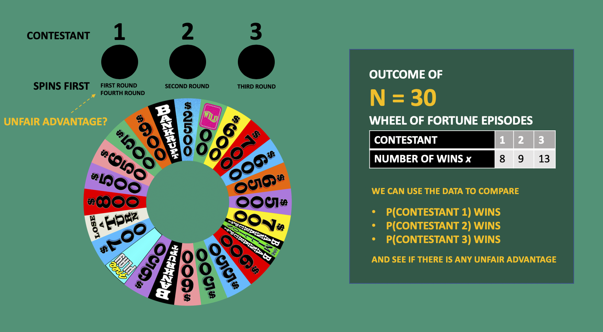

<iframe src="https://maya-gans.shinyapps.io/dir_widget/" height = "425px" width = "800px"></iframe>
[Inspired By Justin Silverman's Blog Post](http://www.statsathome.com/2017/09/14/visualizing-the-multinomial-in-the-simplex/)

My shakey understanding of the very useful Dirichlet Multinomial prior brought me to 
[Dr. Brendon Brewer's lecture](https://www.youtube.com/watch?v=7Lbx9q6q8AE) explaining how it can be used with an example from the Wheel of Fortune. The contests rotate who spins first by round, but there are 4 rounds. Does this give contestant 1 an unfair advantage? Dr. Brewer tabulated the wins from 30 games to find out.



# The Data 
```{r}
data <- data.frame(contestant = c(1,2,3), wins = c(8,9,13))
data
```

# Chi-Square
If we were to approach this using a frequentist approach, we would be testing to ensure each contestant has 1/3 of the probability of winning (out of 30 games, each contestant should win 10 times).

```{r}
chisq.test(data$wins)
```

We did not supply any `given probabilities` because the default is to assume equal probability to each contestant. Our p-value here is `0.5`, we do not have evidence for any unfair advantage among the 3 players from this classical point of view. **But a p-value is not a posterior probability. Also - this test also assumes there are more than 5 occurances in each bin which might not always be the case**

```{r}
data$wins > 5
```

# Bayesian

We can use a hyper-parameter to say *there's a high chance that the three success probabilities are close together, even if they are not exactly the same*.

$$\text{N = 30 trials with } \{\theta_i\} \text{ for going in each bin (winner being contestant 1, 2, or 3)}$$

$$\text{Infer } \{\theta_i\} \text{ from the data (get the posterior distribution)}$$

## The sampling distribution/likelihood will be the **multinomial**


$$p(x_1,x_2,...,x_n|\theta_1,\theta_2,...,\theta_n) = \frac{N!}{x_1!x_2!...x_n!}\theta^{x_1}_1\theta^{x_2}_2\theta^{x_n}_n$$
The probability that all the counts in each category is equal to some outcome given all the success probabilities = the success probabilities to the power of some counts. If we reduce this example to only two outcomes, we would remove the $\theta_n$ part of the equation -- **this is the binomial PDF!**

## The prior will be the **Dirichlet**


$$p(\theta_1,...,\theta_n|\alpha_1,...,\alpha_n) \propto \prod^n_{i=1}\theta^{\alpha_i-1}, \sum^n_{i=1}\theta_i=1$$

In three dimensions (3 contestants), our constraints put our probability on a triangle where the sum is one. The $\alpha$ parameters control how "diverse" the $\theta$ probabilities are. 

# Playing with the widget at the top of the page:
* If we give each $\theta$ equal probability ($\alpha$ = 1/3) we'll be in the middle of the triangle. You can also see that high $\alpha$s result in the probability densities lying close to the middle of the simplex; the region where $\theta_1 = \theta_2 = \theta_3 = H_0$. 

* Setting all the $\alpha$s to 1 will result in a *uniform density*. 

* Setting low values for the $\alpha$s gives high probability density in the corners of the triangle. 
* Feel free to check out how sample size effects these densities too!
  
# JAGS
```{r}
model = "model
{
  for (i in 1:3) {
    # flat, uniform prior over the simplex
    alpha[i] <- 1
  }
  theta ~ ddirch(alpha)
  x ~ dmulti(theta, N)
}
"

# The data (use NA for no data)
data = list(x=c(8,9,13), N = 30)

# Variables to monitor
variable_names = c('theta')

# How many burn-in steps?
burn_in = 1000

# How many proper steps?
steps = 10000

# Thinning?
thin = 1

# Random number seed
seed = 42


# NO NEED TO EDIT PAST HERE!!!
# Just run it all and use the results list.

library(rjags)

# Write model out to file
fileConn=file("model.temp")
writeLines(model, fileConn)
close(fileConn)

if(all(is.na(data)))
{
	m = jags.model(file="model.temp", inits=list(.RNG.seed=seed, .RNG.name="base::Mersenne-Twister"))
} else
{
	m = jags.model(file="model.temp", data=data, inits=list(.RNG.seed=seed, .RNG.name="base::Mersenne-Twister"))
}
update(m, burn_in)
draw = jags.samples(m, steps, thin=thin, variable.names = variable_names)
# Convert to a list
make_list <- function(draw)
{
	results = list()
	for(name in names(draw))
	{
		# Extract "chain 1"
		results[[name]] = as.array(draw[[name]][,,1])
		
		# Transpose 2D arrays
		if(length(dim(results[[name]])) == 2)
			results[[name]] = t(results[[name]])
	}
	return(results)
}
results = make_list(draw)

plot(results$theta[,1], type = "l")
```

This is the success probability of the person in position one, and it looks like their probability is around 1/3. We get similar results for the other two players.

```{r}
mean(results$theta[,1])
mean(results$theta[,2])
mean(results$theta[,3])
```

The third probability is the highest, but that's only because more data went into the third probability than the second, and more in the second than the third. Looking at our original hypothesis:

```{r}
mean(results$theta[,3] > mean(results$theta[,1]))
```

It turns out we were wrong, and contestant three actually has the advantage, not contestant 1. 

```{r}
sd(results$theta[,3])
```

However, the posterior SD is relatively big because these point estimates are not the most reliable. 

# Hierarchical 
We can also make the $\alpha$s an unknown (with the possibility that it's high) rather than assume a particular alpha:

```{r}
model = "model
{
  # alpha can possibly be high (probablities close together)
  # log uniform prior

  # a = e^-1 (probabilites in corners) to e^5 (probabilities in the center)
  log_a ~ dunif(-1,5)

  # set all alphas to be a
  a <- exp(log_a)

  for (i in 1:3) {
    # flat, uniform prior over the simplex
    alpha[i] <- a
  }
  theta ~ ddirch(alpha)
  x ~ dmulti(theta, N)
}
"

# The data (use NA for no data)
data = list(x=c(8,9,13), N = 30)

# Variables to monitor
variable_names = c('theta')

# How many burn-in steps?
burn_in = 1000

# How many proper steps?
steps = 10000

# Thinning?
thin = 1

# Random number seed
seed = 42


# NO NEED TO EDIT PAST HERE!!!
# Just run it all and use the results list.

library(rjags)

# Write model out to file
fileConn=file("model.temp")
writeLines(model, fileConn)
close(fileConn)

if(all(is.na(data)))
{
	m = jags.model(file="model.temp", inits=list(.RNG.seed=seed, .RNG.name="base::Mersenne-Twister"))
} else
{
	m = jags.model(file="model.temp", data=data, inits=list(.RNG.seed=seed, .RNG.name="base::Mersenne-Twister"))
}
update(m, burn_in)
draw = jags.samples(m, steps, thin=thin, variable.names = variable_names)
# Convert to a list
make_list <- function(draw)
{
	results = list()
	for(name in names(draw))
	{
		# Extract "chain 1"
		results[[name]] = as.array(draw[[name]][,,1])
		
		# Transpose 2D arrays
		if(length(dim(results[[name]])) == 2)
			results[[name]] = t(results[[name]])
	}
	return(results)
}
results = make_list(draw)

# trace plot looks good
plot(results$theta[,1], type = "l")
```

The prior put more plausibility on the statement that the three posteriors are closer together. Our uncertainty is also lower because we've used an informative prior!

```{r}
mean(results$theta[,1])
mean(results$theta[,2])
mean(results$theta[,3])

sd(results$theta[,1])
sd(results$theta[,2])
sd(results$theta[,3])
```

Using an informative prior we also see that the player in the third position has a higher advantage (albeit a small one)
```{r}
mean(results$theta[,3] > mean(results$theta[,1]))
```

Because of the constraint that our $\theta$s must add up to 1, there is a correlation in our prior, which also shows up in the posterior (the two are anti-correlated because they need to add up to 1).

```{r}
plot(results$theta[,1], results$theta[,3], cex = 0.1)
```

